[](https://github.com/fathima-rinsha-k745/LifeLink-AI/actions/workflows/django.yml)

# 🩸 LifeLink AI

### AI-Powered Blood Donor Matching & Emergency Response Platform

[](https://python.org)
[](https://djangoproject.com)
[](https://supabase.com)
[](https://deepmind.google)

> **Connecting blood donors and recipients during emergencies — powered by Google Gemini AI.**

---

## 📑 Table of Contents

- [Project Overview](#-project-overview)
- [Problem Statement](#-problem-statement)
- [Live Demo](#-live-demo)
- [Features](#-features)
- [Tech Stack](#️-tech-stack)
- [System Workflow](#-system-workflow)
- [Installation](#-installation)
- [API Documentation](#-api-documentation)
- [Project Structure](#-project-structure)
- [Running Tests](#-running-tests)
- [Screenshots](#-screenshots)
- [AI Capabilities](#-ai-capabilities)
- [Future Enhancements](#-future-enhancements)
- [Author](#-author)

---

## 🌟 Project Overview

**LifeLink AI** is an AI-powered Blood Donor Matching and Emergency Response Platform that connects patients, blood donors, and coordinators through an intelligent emergency response workflow.

The platform supports three user roles — **Requester**, **Donor**, and **Coordinator**. Emergency requests can be submitted through voice or text, where Google Gemini AI extracts patient information, ranks compatible donors based on blood group, location, and availability, and automatically initiates the donor notification workflow. Coordinators can monitor requests, donors, AI logs, and interact with an AI assistant for system insights.

---

## ❗ Problem Statement

Finding compatible blood donors during medical emergencies is often time-consuming and inefficient. Hospitals and patients may struggle to locate available donors quickly, resulting in delays in treatment.

LifeLink AI addresses this challenge by combining Artificial Intelligence, donor management, and emergency response workflows to help connect blood donors and recipients faster.

---

## 🚀 Live Demo

| Environment | Link |
|---|---|
| **Production** | https://lifelink-ai-production-51f6.up.railway.app/ |
| **Staging** | https://lifelink-ai-staging.up.railway.app/ |
| **Swagger Docs** | https://lifelink-ai-production-51f6.up.railway.app/api/schema/swagger-ui/ |

---

## ✨ Features

| Feature | Description |
| --- | --- |
| 🔐 Role-Based Authentication | Separate access for Coordinator, Donor, and Requester |
| 🎙 Voice & Text Emergency Requests | Users can describe emergencies using voice or text |
| 🤖 Gemini AI Emergency Intake | AI extracts structured patient details automatically |
| 🎯 AI Donor Ranking | AI ranks donors using blood group, city, and availability |
| 🔔 AI Notification Workflow | Automatically notifies the highest-ranked donor and proceeds to the next if declined |
| 🩸 Donor Portal | Donors manage profiles, availability, and receive requests |
| 🏥 Coordinator Dashboard | Manage donors, requests, AI logs, and analytics |
| 💬 AI Assistants | Dedicated AI assistants for Requesters, Donors, and Coordinators |
| 📊 AI Logs | Records AI prompts, responses, confidence scores, and actions |
| 📄 Swagger API | Interactive REST API documentation |

---

## 🛠️ Tech Stack

### 🎨 Frontend
- **React** — Frontend library for building user interfaces
- **TypeScript** — Adds type safety to JavaScript
- **Tailwind CSS** — Utility-first CSS framework
- **Framer Motion** — Animation library for React
- **Vite** — Fast development and build tool
- **Axios** — HTTP client for API requests

### ⚙️ Backend
- **Python / Django** — Core language and web framework
- **Django REST Framework** — RESTful API development
- **JWT (SimpleJWT)** — Secure authentication

### 🗄️ Database & AI
- **Supabase PostgreSQL** — Cloud-hosted relational database
- **Google Gemini API** — Natural language processing

### 🔧 Tools
- Git, GitHub, Postman, Swagger (drf-spectacular), GitHub Actions

---

## 🔄 System Workflow

```text
                           LifeLink AI Workflow

                 ┌──────────────────────────────┐
                 │          Requester            │
                 │ (Patient / Hospital User)     │
                 └──────────────┬───────────────┘
                                │
                  Voice / Text Emergency Request
                                │
                                ▼
                     Google Gemini AI
          Extract Patient & Emergency Details
                                │
                                ▼
            Match & Rank Compatible Donors
      (Blood Group + Location + Availability)
                                │
                                ▼
         Notify Best Ranked Donor Automatically
                                │
                 ┌──────────────┴──────────────┐
                 │                             │
            Accept Request                Reject Request
                 │                             │
                 ▼                             ▼
     Share Contact Details          Notify Next Ranked Donor
                 │
                 ▼
      Emergency Blood Donation Completed

────────────────────────────────────────────────────────────

                 ┌──────────────────────────────┐
                 │            Donor              │
                 └──────────────┬───────────────┘
                                │
                 Register / Login as Donor
                                │
                                ▼
          Complete Donor Profile & Availability
                                │
                                ▼
         Receive AI Notification for Blood Request
                                │
                                ▼
                 Accept or Reject Request
                                │
                                ▼
           Update Availability & Donation Status

────────────────────────────────────────────────────────────

                 ┌──────────────────────────────┐
                 │         Coordinator           │
                 └──────────────┬───────────────┘
                                │
                        Secure Login
                                │
                                ▼
      Manage Donors, Blood Requests & AI Logs
                                │
                                ▼
         Monitor AI Matching & Notification
                                │
                                ▼
      Use AI Assistant for Reports & Insights
```

### Supported Blood Group Compatibility

| Request | Compatible Donors |
|---|---|
| O− | O− |
| O+ | O+, O− |
| A+ | A+, A−, O+, O− |
| B+ | B+, B−, O+, O− |
| AB+ | All blood groups |

---

## 🚀 Installation

### Prerequisites
- Python 3.11+
- Node.js 18+
- Git

### 1. Clone the Repository

```bash
git clone https://github.com/fathima-rinsha-k745/LifeLink-AI.git
cd LifeLink-AI/backend
```

### 2. Backend Setup

1. Create a `.env` file in the `backend/` directory using the `.env.example` format (or edit the existing one).
2. Define the Coordinator username and password environment variables:
3. Install dependencies and run the server:
   ```bash
   pip install -r requirements.txt
   python manage.py migrate
   python manage.py runserver
   ```


### 3. Frontend Setup

```bash
cd frontend
npm install
npm run dev
```

---

## 📚 API Documentation

**Swagger UI:** https://lifelink-ai-production-51f6.up.railway.app/api/schema/swagger-ui/

**Postman Collection:** https://documenter.getpostman.com/view/55563067/2sBXwvH81i

**Local Documentation (MkDocs):** http://127.0.0.1:8000/

### Key Endpoints

| Method | Endpoint | Description | Auth |
|---|---|---|---|
| `POST` | `/api/auth/register/` | Register new user | ❌ |
| `POST` | `/api/auth/login/` | Obtain JWT token | ❌ |
| `GET` | `/api/donors/` | List all donors | ✅ |
| `POST` | `/api/donors/` | Register as donor | ✅ |
| `GET` | `/api/blood-requests/` | List blood requests | ✅ |
| `POST` | `/api/ai-intake/` | AI emergency parser | ✅ |
| `GET` | `/api/ai-logs/` | View AI logs | ✅ |

---

## 📁 Project Structure

```
LifeLink-AI/                 (Root Workspace)
│
├── .github/                 # CI/CD Workflows (tests run automatically on commit)
│   └── workflows/
│       └── django.yml
│
├── backend/                 # Python / Django Backend Application
│   ├── config/               # Global project settings, URLs, & views
│   │   ├── settings.py       # Database settings, CORS, and Allowed Hosts
│   │   └── urls.py           # API and template URL routing
│   ├── users/                 # Authentication, registration & coordinators app
│   ├── donors/                # Donor profiles, registration & details app
│   ├── requests_app/          # Blood requests database & matching engine app
│   ├── ai_intake/              # Google Gemini AI intake workflow app
│   ├── templates/              # Server-side HTML templates folder
│   │   └── home.html          # The compiled single-file React bundle served by Django
│   ├── static/                 # Django static assets folder
│   ├── manage.py               # Main Django command-line execution script
│   ├── requirements.txt        # Python backend dependencies
│   ├── Procfile                 # Process configuration file inside the backend dir
│   ├── pytest.ini               # Configuration for python automated tests
│   └── .env                    # Environment file for secrets (Supabase DB credentials, etc.)
│
├── frontend/                # React + Vite + Tailwind + TypeScript Frontend
│   ├── src/                     # Frontend React code (pages, components, css)
│   │   ├── api/
│   │   │   └── client.ts        # Axios API client pointing to relative path `/api`
│   │   ├── components/           # Reusable UI elements (cards, buttons)
│   │   ├── pages/                 # Landing, Dashboard, Donor, Requester pages
│   │   ├── App.tsx                # Main React router and authentication logic
│   │   └── main.tsx                # React app DOM mounting point
│   ├── public/                     # Public asset folder (images, icons)
│   ├── index.html                  # React root HTML (source file Vite uses to compile home.html)
│   ├── package.json                # Node scripts & dependencies (contains the build/move script)
│   ├── vite.config.ts              # Vite config (defines output directory and dev proxy)
│   └── tsconfig.json               # TypeScript configuration settings
│
├── docs/                    # Architecture diagrams & specifications documentation
├── Procfile                 # Root process file tells Railway how to run migrations and start gunicorn
├── pyproject.toml           # Configuration files for tools
├── mkdocs.yml               # MkDocs config file
├── requirements.txt         # Root requirements file pointing to backend dependencies
├── package.json             # Root node configuration
└── README.md                # Readme documentation showing setup, endpoints, & URLs
```

---

## 🧪 Running Tests

```bash
cd backend

# Run all tests
pytest

# Verbose output
pytest -v

# Generate coverage report
coverage run -m pytest
coverage report
coverage html
```

---

## 📸 Screenshots

### Swagger API Documentation
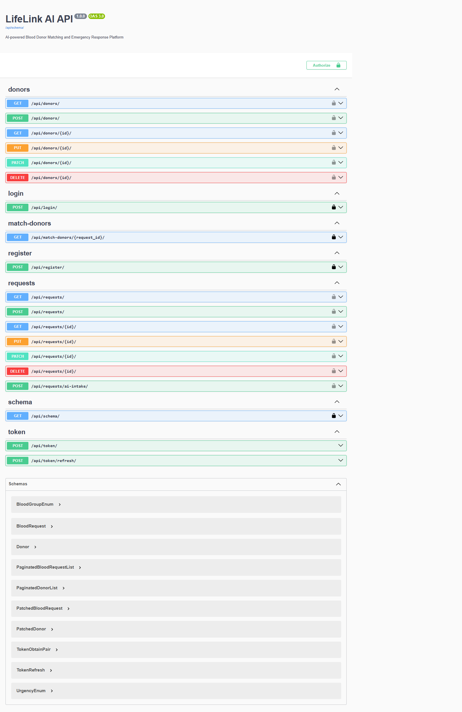

### MkDocs Documentation Site
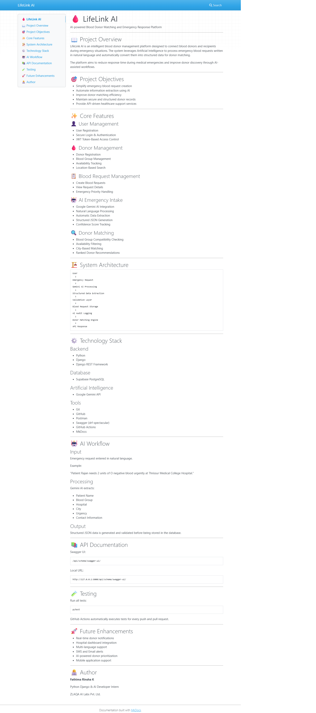

### Test Coverage Report
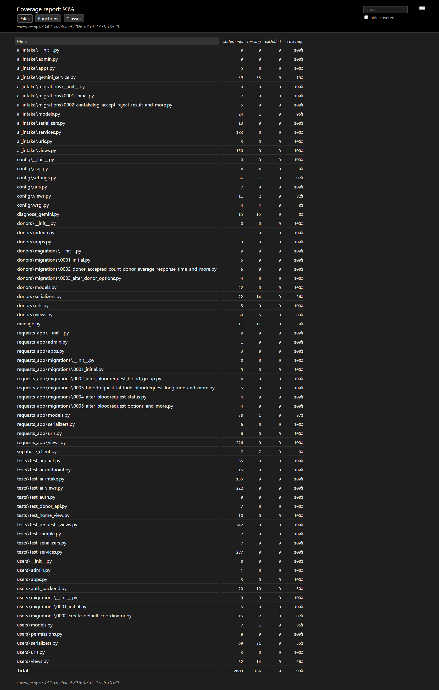

### UptimeRobot Monitoring
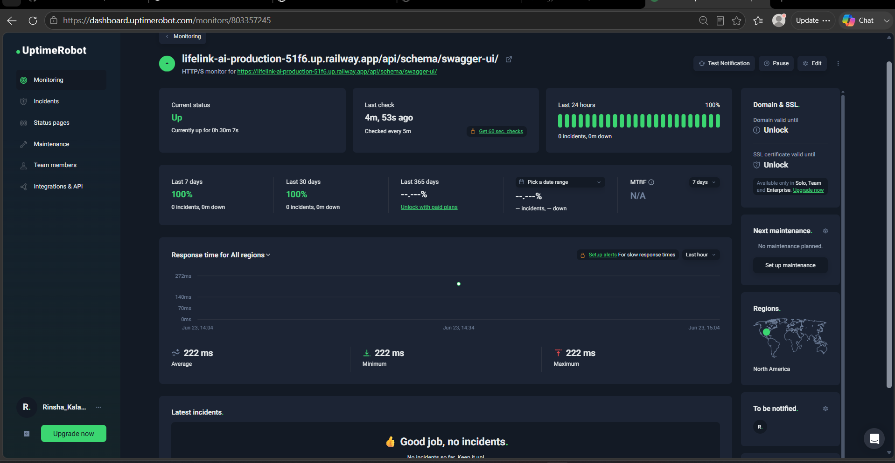

---
## 📸 System Screenshots

## Landing Page
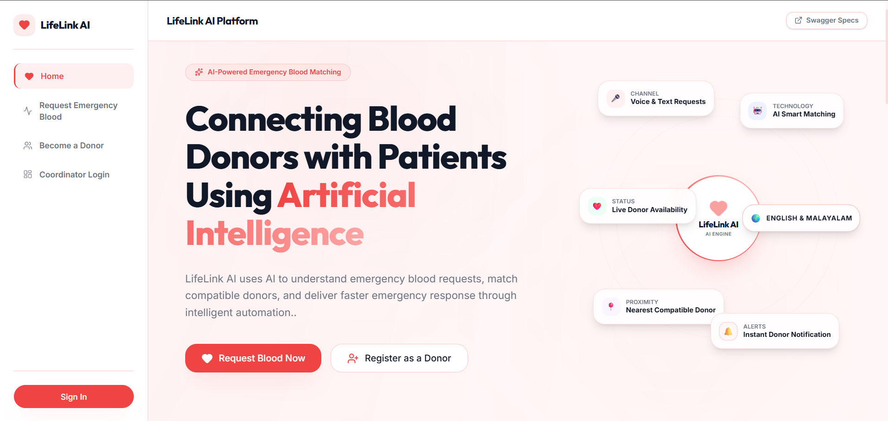

### Request portal
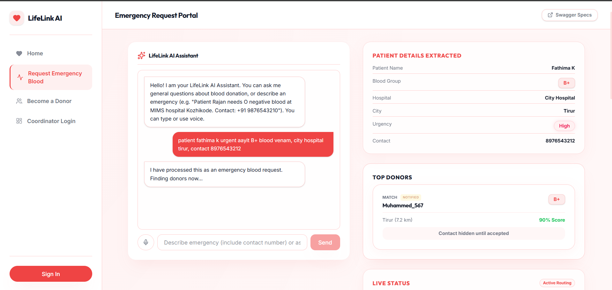

### Live status
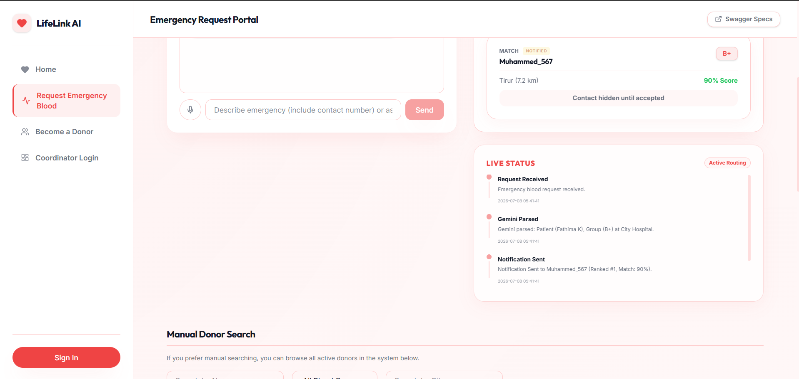

### Donor registration
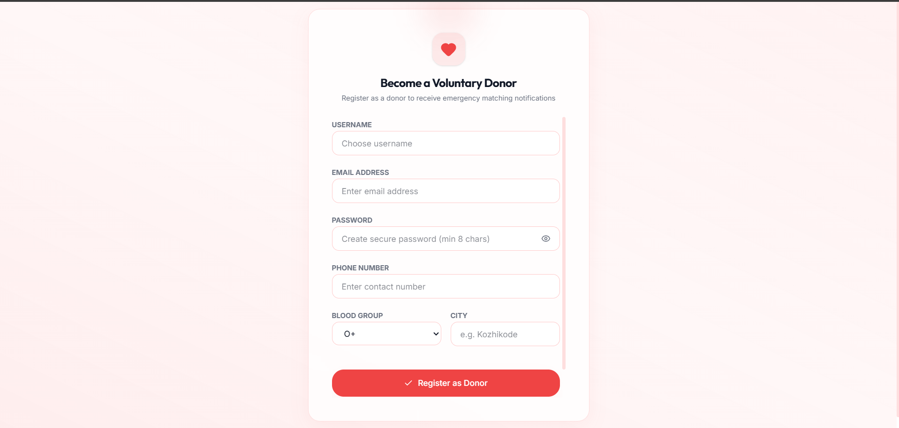

### Donor's profile
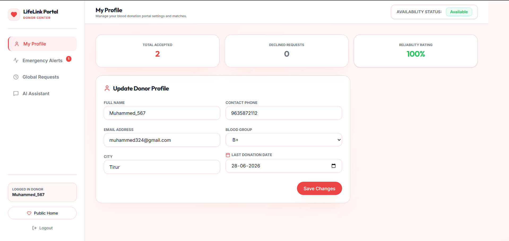

### Emergency alerts for Donors
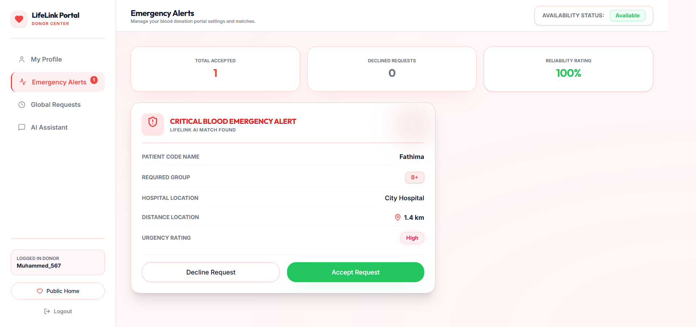

### Donor AI assistant
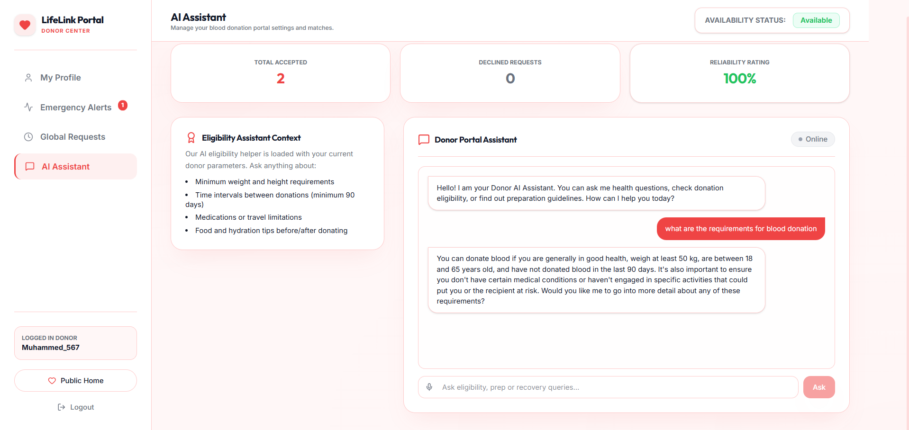

### Coordinator login
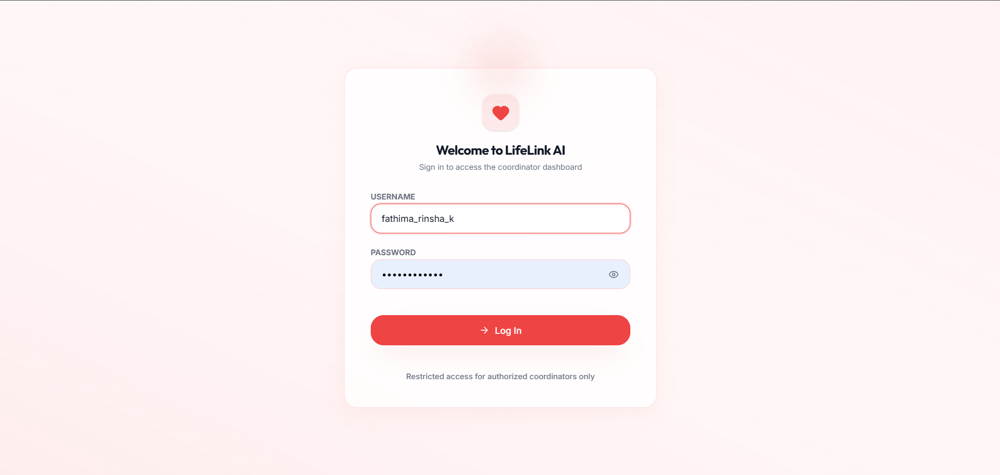

### Coordinator dashboard
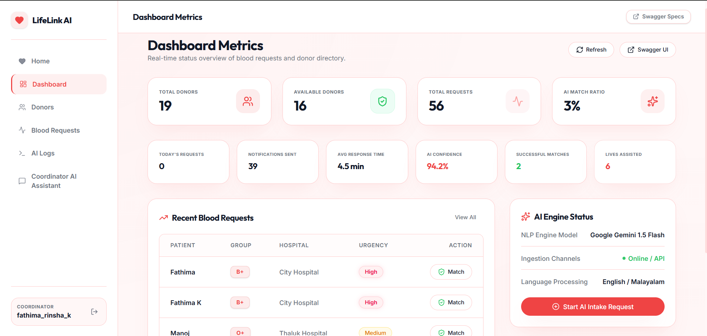

### Coordinator's AI assistant
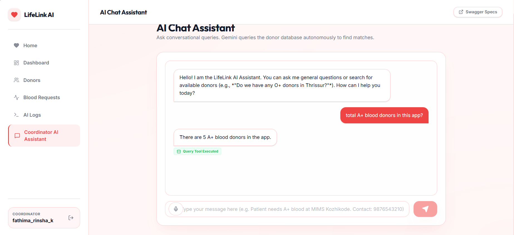

### Ai Logs
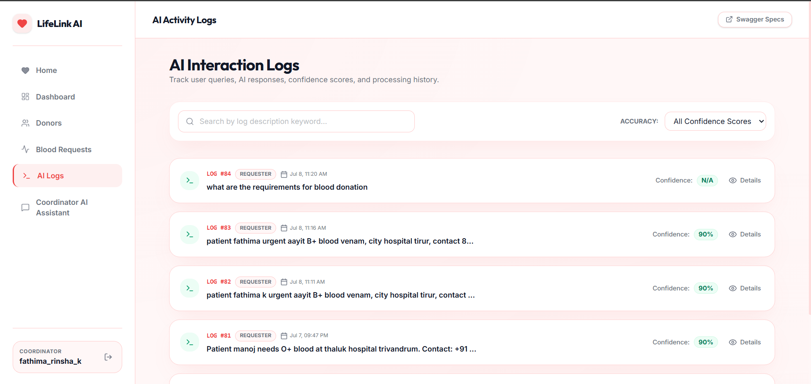


## 🤖 AI Capabilities

- 🎙 Voice-to-Text Emergency Requests
- 📝 Natural Language Request Parsing
- 🩸 AI-Based Blood Donor Matching
- 📍 Location-Based Donor Ranking
- 🔔 AI-Assisted Donor Notification Workflow
- 💬 AI Assistants for Requesters, Donors, and Coordinators
- 📊 AI Logs for Monitoring and Auditing

---

## 🔮 Future Enhancements

- [ ] 📱 **Mobile App** — React Native for iOS and Android
- [ ] 🔔 **Real-time Notifications** — SMS/WhatsApp alerts via Twilio
- [ ] 🗺️ **Geolocation Matching** — GPS-based proximity search
- [ ] 🌐 **Multi-language Support** — Tamil, Hindi, and more
- [ ] 🏥 **Hospital Portal** — Dedicated interface for hospital staff

---

## 👩‍💻 Author

### Fathima Rinsha K

**Python · Django · AI Developer Intern**

🏢 ZLAQA AI Labs Pvt. Ltd.

[](https://github.com/fathima-rinsha-k745)

---

<p align="center">Made with ❤️ and ☕ to save lives</p>
