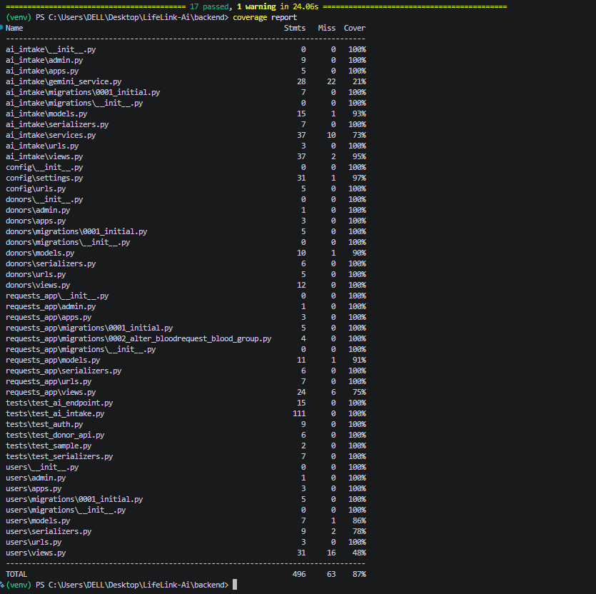

[](https://github.com/fathima-rinsha-k745/LifeLink-AI/actions/workflows/django.yml)

# 🩸 LifeLink AI

### AI-Powered Blood Donor Matching & Emergency Response Platform

[](https://python.org)
[](https://djangoproject.com)

[](https://supabase.com)
[](https://deepmind.google)

> **Connecting blood donors and recipients during emergencies — powered by Google Gemini AI.**

---

## 🌟 Project Overview

**LifeLink AI** is an AI-powered Blood Donor Matching and Emergency Response Platform built using Django, **Django REST Framework**, **PostgreSQL**, and **Google Gemini AI**. The system provides an interactive web dashboard for coordinators along with REST APIs for donor and emergency request management.
During emergencies, time is everything. Users describe a blood emergency in plain natural language — in **English or Malayalam** — and the system instantly extracts structured request details, matches compatible donors, and coordinates a response.

```
"We need O+ blood urgently for a patient at MIMS Hospital, Kozhikode. Contact: 9876543210."

             ⬇ Gemini AI

{ patient: "Arjun", blood_group: "O+", hospital: "MIMS Hospital", city: "Kozhikode" }
```

---
## 🚀 Live Demo

### Production

https://lifelink-ai-production-51f6.up.railway.app/

### Staging

https://lifelink-ai-staging.up.railway.app/

### Swagger Documentation

https://lifelink-ai-production-51f6.up.railway.app/api/schema/swagger-ui/

## ❗ Problem Statement

Finding compatible blood donors during medical emergencies is often time-consuming and inefficient. Hospitals and patients may struggle to locate available donors quickly, resulting in delays in treatment.

LifeLink AI addresses this challenge by combining Artificial Intelligence, donor management, and emergency response workflows to help connect blood donors and recipients faster.

---

## ✨ Features

| Feature | Description |
|---|---|
| 🔐 **User Authentication** | Secure JWT-based registration and login |
| 🩸 **Donor Management** | Register, update, and search donors by blood group |
| 📋 **Blood Requests** | Create and manage emergency blood requests |
| 🤖 **AI Emergency Intake** | Parse natural language into structured data |
| 🧠 **Google Gemini AI** | Extracts name, blood group, hospital, urgency, contact |
| 🎯 **Donor Matching** | Automatically finds compatible, available donors |
| 📊 **AI Audit Logging** | Stores AI input, output, and confidence scores |
| 📄 **Swagger Docs** | Full interactive API documentation |

---

## 🛠️ Tech Stack

### Backend
- **Python / Django** — Core language and web framework
- **Django REST Framework** — RESTful API development
- **JWT (SimpleJWT)** — Secure authentication

### Database & AI
- **Supabase PostgreSQL** — Cloud-hosted relational database
- **Google Gemini API** — Natural language processing

### Tools
- Git, GitHub, Postman, Swagger (drf-spectacular), GitHub Actions

---

## 🚀 Installation

### Prerequisites
- Python 3.11+
- Node.js 18+
- Git

### Clone the repository

```bash
git clone https://github.com/fathima-rinsha-k745/LifeLink-AI.git
cd LifeLink-AI/backend
```

### Backend setup

1. Create a `.env` file in the `backend/` directory using the `.env.example` format (or edit the existing one).
2. Define the Coordinator username and password environment variables:
   ```env
   COORDINATOR_USERNAME=fathima_rinsha_k
   COORDINATOR_PASSWORD=rinsha98765k
   ```
3. Install dependencies and run server:
   ```bash
   pip install -r requirements.txt
   python manage.py migrate
   python manage.py runserver
   ```

> API available at **http://127.0.0.1:8000/**

---

## 📚 Project Documentation

Swagger UI: **https://lifelink-ai-production-51f6.up.railway.app/api/schema/swagger-ui/**

| Method | Endpoint | Description | Auth |
|---|---|---|---|
| `POST` | `/api/auth/register/` | Register new user | ❌ |
| `POST` | `/api/auth/login/` | Obtain JWT token | ❌ |
| `GET` | `/api/donors/` | List all donors | ✅ |
| `POST` | `/api/donors/` | Register as donor | ✅ |
| `GET` | `/api/blood-requests/` | List blood requests | ✅ |
| `POST` | `/api/ai-intake/` | AI emergency parser | ✅ |
| `GET` | `/api/ai-logs/` | View AI logs | ✅ |


### MkDocs Site

Local Documentation:

http://127.0.0.1:8000/

### Postman Collection

https://documenter.getpostman.com/view/55563067/2sBXwvH81i

---

## 🏗️ System Architecture

See detailed architecture:

[docs/architecture.md](https://github.com/fathima-rinsha-k745/LifeLink-AI/blob/main/docs/architecture.md)

### Supported blood group compatibility

| Request | Compatible Donors |
|---|---|
| O− | O− |
| O+ | O+, O− |
| A+ | A+, A−, O+, O− |
| B+ | B+, B−, O+, O− |
| AB+ | All blood groups |

---

## 📁 Project Structure

LifeLink-AI/
│
├── backend/
│   ├── config/
│   ├── users/
│   ├── donors/
│   ├── requests_app/
│   ├── ai_intake/
│   ├── templates/
│   └── static/
│
├── docs/
│
├── .github/
│
├── README.md
│
└── requirements.txt

---

## 🧪 Running Tests

```bash
cd backend
python manage.py test
python manage.py test --verbosity=2
```

### Coverage report

```bash
pip install coverage
coverage run manage.py test
coverage report
coverage html
```

---
## 📸 Screenshots

### Swagger API Documentation


### MkDocs Documentation Site


### Test Coverage Report



### UptimeRobot Monitoring


---

## 🔮 Future Enhancements

- [ ] 📱 **Mobile App** — React Native for iOS and Android
- [ ] 🔔 **Real-time Notifications** — SMS/WhatsApp alerts via Twilio
- [ ] 🗺️ **Geolocation Matching** — GPS-based proximity search
- [ ] 🌐 **Multi-language Support** — Tamil, Hindi, and more
- [ ] 📊 **Admin Dashboard** — Analytics for blood bank administrators
- [ ] 🏥 **Hospital Portal** — Dedicated interface for hospital staff

---

## 👩‍💻 Author


### Fathima Rinsha K

**Python · Django · AI Developer Intern**

🏢 ZLAQA AI Labs Pvt. Ltd.

[](https://github.com/fathima-rinsha-k745)


---


Made with ❤️ and ☕ to save lives
