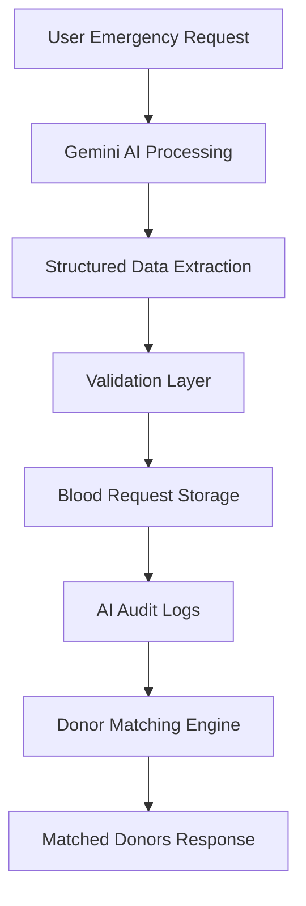

# LifeLink AI Architecture

```mermaid
flowchart TD

A[User Emergency Request]
--> B[Gemini AI Processing]

B --> C[Structured Data Extraction]

C --> D[Validation Layer]

D --> E[Blood Request Storage]

E --> F[AI Audit Logs]

F --> G[Donor Matching Engine]

G --> H[Matched Donors Response]
```

## Components

* User Interface (React)
* Django REST API
* Gemini AI Service
* Supabase PostgreSQL
* Donor Matching Engine
* Swagger Documentation
* Postman Collection
