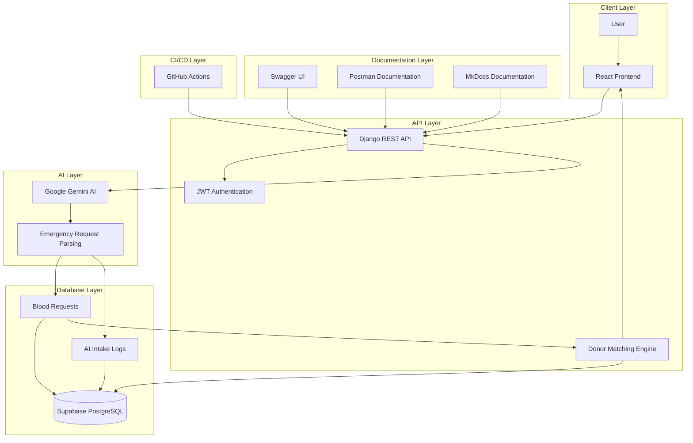

# LifeLink AI Architecture

## Overview

LifeLink AI is an AI-powered Blood Donor Matching and Emergency Response Platform that helps connect blood donors and recipients during emergencies. The system uses Django REST Framework, Supabase PostgreSQL, JWT Authentication, and Google Gemini AI to process emergency requests and find compatible donors.

## System Architecture

## Components

### Client Layer

* React.js frontend for user interaction.
* Allows donor registration and emergency blood requests.

### API Layer

* Django REST Framework backend.
* Handles authentication, business logic, and donor matching.

### AI Layer

* Google Gemini AI processes emergency descriptions.
* Extracts structured information such as blood group, hospital, city, urgency, and contact details.

### Database Layer

* Supabase PostgreSQL stores users, donors, blood requests, and AI logs.
* Maintains audit records of AI processing.

### Documentation Layer

* Swagger UI for interactive API testing.
* Postman Collection for API documentation.
* MkDocs for project documentation.

### CI/CD Layer

* GitHub Actions runs automated tests and validates code changes.

## Workflow

1. User submits an emergency blood request.
2. Request is sent to the Django REST API.
3. JWT Authentication validates access.
4. Emergency description is processed by Google Gemini AI.
5. AI extracts structured request information.
6. Data is validated and stored in Supabase PostgreSQL.
7. AI input and output are logged for auditing.
8. Donor Matching Engine finds compatible donors.
9. Matching donor information is returned to the user.
10. API documentation is available through Swagger and Postman.
