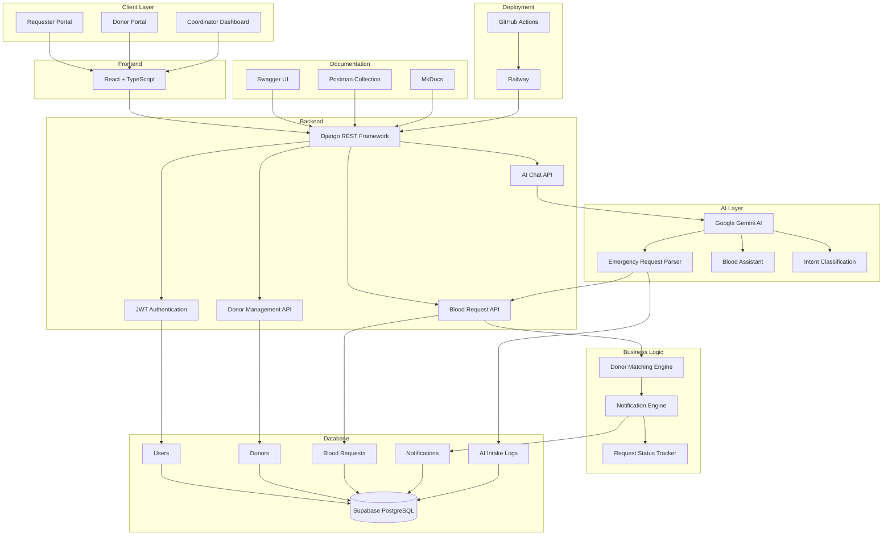

# LifeLink AI Architecture

# Overview

LifeLink AI is an AI-powered Emergency Blood Donor Matching and Response Platform designed to connect patients with suitable blood donors during medical emergencies. The platform enables requesters to submit emergency blood requests using natural language (text or voice) in English or Malayalam. Google Gemini AI extracts structured emergency information, automatically creates blood requests, intelligently matches donors, and supports AI-powered blood-related queries. The platform also provides dedicated dashboards for Requesters, Donors, and Coordinators, enabling complete monitoring of the emergency workflow.

---

# System Architecture

---

# System Components

## Client Layer

The platform supports three primary user roles:

### Requester

- Submit emergency blood requests using text or voice.
- Supports English and Malayalam input.
- View live request status.
- Interact with the AI Blood Assistant.

### Donor

- Register and log in securely.
- Update donor profile and availability.
- Receive emergency notifications.
- Accept or reject blood requests.
- Access AI-powered blood donation assistance.

### Coordinator

- Monitor the complete emergency workflow.
- Manage donor records.
- Create and manage blood requests.
- View AI activity logs and request status.
- Use the Coordinator AI Assistant.

---

# Frontend Layer

Built using:

- React
- TypeScript
- Tailwind CSS
- Framer Motion

Provides responsive dashboards for all user roles with a modern user interface.

---

# Backend Layer

Built using Django REST Framework.

Responsible for:

- Authentication
- User management
- Blood request management
- Donor management
- AI integration
- Notification workflow
- Status tracking

---

# AI Layer

Google Gemini AI powers several intelligent features:

- Natural language understanding
- Emergency information extraction
- Voice-to-text request processing
- English and Malayalam support
- Blood-related question answering
- Intent classification
- Confidence scoring

The AI converts unstructured emergency descriptions into structured data suitable for automated processing.

---

# Business Logic Layer

## Donor Matching Engine

Ranks donors based on:

- Blood group compatibility
- Current availability
- Nearest location
- Last donation date

## Notification Engine

Automatically sends notifications to the highest-ranked donor.

If a donor:

- Rejects the request, or
- Does not respond within the configured timeout,

the system automatically notifies the next most suitable donor.

## Request Status Tracker

Tracks the complete lifecycle of a blood request:

- Request Created
- Notification Sent
- Accepted
- Rejected
- Timed Out
- Completed

---

# Database Layer

Supabase PostgreSQL stores:

- Users
- Donors
- Blood Requests
- Notifications
- AI Intake Logs

The database maintains complete records of emergency requests and AI processing activities for auditing and monitoring.

---

# Documentation Layer

The project includes:

- Swagger UI for interactive REST API documentation.
- Postman Collection for API testing.
- MkDocs for technical documentation.

---

# Deployment & CI/CD

Deployment:

- Railway

Continuous Integration:

- GitHub Actions

GitHub Actions automatically:

- Execute unit tests
- Run integration tests
- Measure code coverage
- Validate pull requests before deployment

---

# System Workflow

1. A requester submits an emergency blood request using text or voice.
2. Google Gemini AI identifies whether the input is an emergency request or a general blood-related query.
3. For emergency requests, AI extracts patient information including blood group, hospital, city, urgency, contact details, and required units.
4. The system validates the extracted information and creates a structured blood request.
5. The Donor Matching Engine ranks compatible donors based on blood group compatibility, availability, proximity, and last donation date.
6. The Notification Engine sends alerts to the highest-ranked donor.
7. If the donor accepts, the request is marked as completed.
8. If the donor rejects or fails to respond within the configured timeout, the system automatically notifies the next suitable donor.
9. Coordinators monitor the complete process through the Coordinator Dashboard.
10. AI activities and emergency requests are recorded in AI Intake Logs for auditing.
11. Users can also interact with the AI Blood Assistant to ask blood donation and blood availability-related questions.

---

# Technology Stack

| Layer | Technology |
|--------|------------|
| Frontend | React, TypeScript, Tailwind CSS, Framer Motion |
| Backend | Django REST Framework |
| Database | Supabase PostgreSQL |
| Authentication | JWT Authentication |
| AI | Google Gemini AI |
| Documentation | Swagger, Postman, MkDocs |
| Deployment | Railway |
| CI/CD | GitHub Actions |
| Testing | Pytest + Coverage |